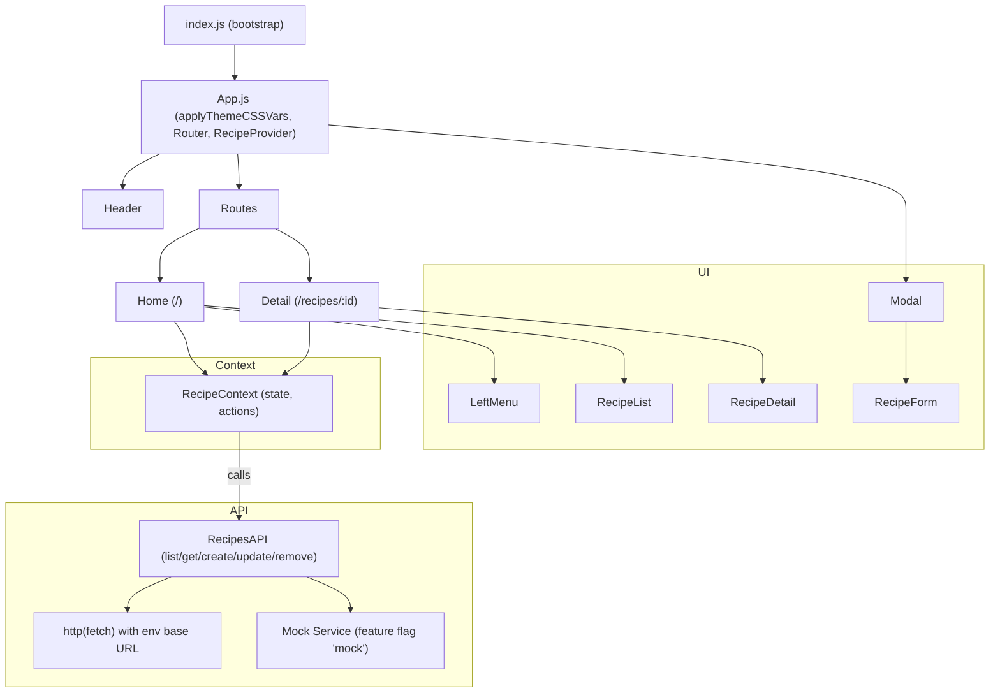

# Recipe Pro Frontend Architecture

## Overview

The Recipe Explorer application is a modern, responsive React single-page application (SPA) that allows users to browse, search, and manage recipes. It implements the Ocean Professional theme, emphasizing a clean, accessible UI with blue and amber accents, rounded corners, subtle shadows, and gradients. The frontend integrates with a RESTful backend API for CRUD operations and supports a built-in mock API for development and preview environments via feature flags.

This document describes the architecture, components, routing, state management, API integration strategy, data models, error handling, theming, accessibility, security placeholders, environment configuration, deployment considerations, scalability, and future extensions. It references the current code to ensure accuracy.

## Goals and Non-Goals

### Goals
- Provide a clear, maintainable SPA in React with a modular component structure.
- Implement a consistent theme (Ocean Professional) via CSS variables and a theme module.
- Support recipe discovery, search, filtering by category, and full CRUD flows.
- Offer a robust API integration with environment-based URL resolution and a mock fallback for development and demos.
- Ensure accessibility considerations for navigation, focus management, semantics, and dialogs.
- Keep state management simple and transparent using React Context and hooks.

### Non-Goals
- Implement backend authentication and authorization; placeholders are provided for future integration.
- Provide server-side rendering or Next.js; this app is client-rendered using Create React App.
- Implement advanced global state libraries (Redux/Zustand/MobX); current scope is covered by Context.
- Provide offline/Service Worker strategies beyond CRA defaults.

## High-Level Architecture

The app is a client-side React SPA structured into the following layers:

- App shell and routing: Initializes the theme, sets up providers, and defines top-level routes.
- Context (state management): A centralized RecipeContext holds recipe list state, filters, and CRUD actions.
- UI components: Header, left navigation, listing, detail view, modal, and form components.
- API client: A thin wrapper over fetch for REST calls with environment URL resolution and mock API fallback.
- Theming: A theme module that injects CSS variables into the document root; stylesheets refer to the variables.

### High-Level Architecture Diagram Description

- Browser loads the SPA (index.js -> App).
- App applies theme variables (theme.js) and mounts RecipeProvider and Router.
- Pages are rendered:
  - “/” routes to Home, which consumes RecipeContext to show categories and the list with search.
  - “/recipes/:id” routes to Detail, which fetches and renders a single recipe.
- Components (RecipeList, RecipeDetail, RecipeForm, Modal, LeftMenu, Header) compose the UI.
- RecipeContext calls RecipesAPI methods to fetch or mutate data.
- RecipesAPI resolves base URL via environment variables and falls back to /api; when feature flag mock is enabled, it uses the in-memory mock service.

## Component Architecture

- App.js
  - App: Initializes theme (applyThemeCSSVars) and wraps children with Router and RecipeProvider.
  - AppShell: Renders Header, Routes, and a modal for creating recipes.
- Components:
  - Header.js: Brand, theme subtitle, and a New Recipe button; displays resolved API base as a chip.
  - LeftMenu.js: Accessible category navigation with active state indication.
  - RecipeList.js: Search input and a responsive grid of recipe cards; shows placeholders during loading and errors when present.
  - RecipeDetail.js: Detail page content with hero image, ingredients, instructions, and Edit/Delete actions; loading and error states handled locally.
  - RecipeForm.js: Create/Edit form with client-side validation and accessible error messaging.
  - Modal.js: Accessible dialog with focus management and ESC-to-close.
- Pages:
  - Home.js: Composes LeftMenu and RecipeList; debounced reload on search/category changes.
  - Detail.js: Composes RecipeDetail and opens the edit Modal; orchestrates update flow with context actions.
- Context:
  - context/RecipeContext.js: Central store for recipe list, filters, loading, errors; provides CRUD methods that delegate to the API client.
- API:
  - api/client.js: Resolves base URL, wraps fetch with error handling, and provides RecipesAPI methods; includes a mock service.

## Routing

- Routes are defined in App.js using react-router-dom v6:
  - “/” — Home page with category filter and search-driven recipe list.
  - “/recipes/:id” — Detail page for a single recipe.

The Router is set up with BrowserRouter to support clean URLs.

References:
- src/App.js
- src/pages/Home.js
- src/pages/Detail.js

## State Management (Context)

RecipeContext centralizes:
- Data: recipes list.
- UI state: loading, error, search string, active category, categories derived from recipes.
- Actions: reload (list), createRecipe, updateRecipe, deleteRecipe.

Key patterns:
- useEffect for initial and reactive loads.
- Debouncing in Home.js before calling reload with search/category filters.
- Derived categories via Set and exposing “All” plus distinct categories.

References:
- src/context/RecipeContext.js
- src/pages/Home.js

## API Integration Strategy

### Base URL Resolution
- api/client.js resolves the base URL as:
  - REACT_APP_API_BASE || REACT_APP_BACKEND_URL
  - If neither is set, it falls back to relative “/api” to support reverse proxy setups.
- Whitespace is trimmed and trailing slashes removed.

Function:
- getApiBaseUrl returns the resolved value for display (Header chip).

### Mock Fallback
- Feature flags are derived from REACT_APP_FEATURE_FLAGS.
- Enabling “mock” or “mock-api” switches RecipesAPI methods to an in-memory mock service.
- Mock data includes realistic objects and supports list/get/create/update/remove with artificial latency.

### HTTP Client
- http(path, { method, body, headers }) wraps fetch:
  - JSON content-type by default.
  - Throws informative Error on non-OK responses including status and server text when available.
  - Parses JSON responses when content-type suggests JSON, otherwise returns text.

### REST Contract
- GET /recipes?q=&category=
- GET /recipes/:id
- POST /recipes
- PUT /recipes/:id
- DELETE /recipes/:id

References:
- src/api/client.js
- src/components/Header.js

## Data Models

These models represent the expected structure at the UI boundary. In mock mode, they are enforced by the in-memory dataset; with a real backend, these shape the contract expectations.

### Recipe
- id: string
- title: string
- description: string
- category: string (e.g., Breakfast, Main, Other)
- tags: string[]
- imageUrl: string (URL)
- ingredients: string[] (displayed as bullets)
- instructions: string[] (displayed as ordered steps)

### Ingredient
- Represented as a simple string line item (e.g., “1 cup flour”).
- In RecipeForm, users input ingredients as newline-separated strings which are mapped to string[].

### Category
- Represented as a string; categories are derived from recipes and shown as:
  - [“All”, ...distinct categories]
- Active category is tracked in context and used in fetch filters.

References:
- src/api/client.js (mock DB structure)
- src/components/RecipeDetail.js
- src/components/RecipeList.js
- src/context/RecipeContext.js
- src/components/RecipeForm.js

## Error Handling and Loading States

- API client throws detailed errors including HTTP status.
- RecipeContext sets error messages suitable for UI display on list failures.
- RecipeList displays an error alert element with role="alert".
- RecipeDetail manages its own loading skeleton and error alert for get failures.
- Loading indicators:
  - Skeleton cards in RecipeList.
  - Skeleton full-width section in RecipeDetail.
- Form-level errors:
  - RecipeForm runs synchronous validation and shows field errors with aria-invalid.

References:
- src/api/client.js
- src/components/RecipeList.js
- src/components/RecipeDetail.js
- src/components/RecipeForm.js
- src/context/RecipeContext.js

## Theming (Ocean Professional)

- theme.js defines OceanProfessionalTheme with colors, radii, shadows, and a spacing helper.
- applyThemeCSSVars applies CSS variables on document root early in App initialization.
- styles.css and App.css reference CSS variables for consistent theming across components.
- Colors include:
  - Primary: #2563EB
  - Secondary/Accent/Success: #F59E0B
  - Error: #EF4444
  - Text, background, surface, borders, overlay, subtle gradient stops

References:
- src/theme.js
- src/styles.css
- src/App.css
- src/components/*

## Accessibility

- Semantic roles and ARIA:
  - Header uses role="banner".
  - LeftMenu is a nav with an aria-label and uses aria-current for active category.
  - Alerts use role="alert".
  - Modal uses role="dialog", aria-modal, aria-labelledby, and focus management; ESC closes the dialog.
- Keyboard interactions:
  - Modal listens for Escape to close; focus is programmatically set to the dialog.
  - Inputs use :focus styles with visible outline and focus ring.
- Semantic structure:
  - Lists and sections use appropriate HTML semantics.
  - Buttons and links are used according to function.

References:
- src/components/Modal.js
- src/components/LeftMenu.js
- src/components/RecipeList.js
- src/components/RecipeDetail.js
- src/styles.css

## Security and Auth Placeholders

- The current app does not implement authentication; endpoints are assumed to be publicly accessible or protected by the backend.
- To introduce authentication:
  - Provide an AuthContext to manage tokens and user state.
  - Extend http() to attach Authorization headers from context or storage.
  - Handle 401/403 in a central place (e.g., redirect to login or show a message).
  - Consider REACT_APP_WS_URL for future real-time updates if needed.
- Sensitive configuration:
  - Ensure environment variables do not expose secrets in the client bundle.
  - Use reverse proxy or gateway for credentialed or sensitive operations.

## Environment Configuration

Supported environment variables (define in .env or injected at build time):
- REACT_APP_API_BASE: Base URL for backend API (e.g., https://api.example.com)
- REACT_APP_BACKEND_URL: Alternative base URL if REACT_APP_API_BASE is not set
- REACT_APP_FRONTEND_URL
- REACT_APP_WS_URL
- REACT_APP_NODE_ENV
- REACT_APP_NEXT_TELEMETRY_DISABLED
- REACT_APP_ENABLE_SOURCE_MAPS
- REACT_APP_PORT
- REACT_APP_TRUST_PROXY
- REACT_APP_LOG_LEVEL
- REACT_APP_HEALTHCHECK_PATH
- REACT_APP_FEATURE_FLAGS: Comma-separated flags; include “mock” or “mock-api” to enable mock service
- REACT_APP_EXPERIMENTS_ENABLED

Resolution rules:
- API base URL is computed as REACT_APP_API_BASE || REACT_APP_BACKEND_URL || “/api”.
- Feature flags are parsed case-insensitively and trimmed for whitespace.

Example .env:
```
REACT_APP_API_BASE=
REACT_APP_BACKEND_URL=
REACT_APP_FEATURE_FLAGS=mock
```

References:
- recipe_frontend/README.md (Environment Variables)
- src/api/client.js
- src/components/Header.js

## Deployment and Preview Considerations

- Development: npm start (CRA dev server at http://localhost:3000).
- Testing: npm test runs in CI mode.
- Production build: npm run build generates a static bundle suitable for hosting on any static site server or behind a reverse proxy.

API routing:
- When deploying behind a reverse proxy, configure the backend to be accessible at the path /api or set REACT_APP_API_BASE to the fully qualified API URL.
- In preview environments without a backend, set REACT_APP_FEATURE_FLAGS=mock to use the built-in mock API.

Security headers and caching:
- Add standard security headers at the hosting layer (CSP, X-Content-Type-Options, X-Frame-Options, Referrer-Policy).
- Static assets can be cached aggressively; ensure HTML is served with no-cache if frequent deployments.

## Scalability

- UI scaling:
  - The grid and layout are responsive and can handle many recipes via virtualization if needed in the future (e.g., react-window for very large lists).
  - Debounced searches prevent excessive fetches.
- State scaling:
  - Context currently suits the app scope; if state grows complex or multiple domains arise, consider modular contexts or a state library (Redux Toolkit, Zustand).
- API scaling:
  - RecipesAPI is an isolated module; it can be extended for pagination, sorting, and advanced filters.
  - Introduce request cancellation (AbortController) to avoid race conditions on rapid user input.

## Future Extensions

- Authentication and user-specific features (favorites, collections):
  - Add AuthContext, login flows, and protect routes.
- Pagination and infinite scroll for large datasets.
- Image uploads and media optimization.
- Internationalization (i18n) and RTL support.
- Real-time updates via WebSocket (REACT_APP_WS_URL).
- Improved form validation using a schema validator (e.g., Zod/Yup) and better error surfaces.
- Analytics and telemetry gated behind REACT_APP_NEXT_TELEMETRY_DISABLED.

## File Reference Index

- src/index.js — App bootstrap.
- src/App.js — App shell, routes, and create modal; theme setup.
- src/api/client.js — API client with environment base URL resolution and mock fallback; RecipesAPI and getApiBaseUrl.
- src/context/RecipeContext.js — Global recipe state, filters, loading, error, and CRUD actions.
- src/pages/Home.js — Home route composition; debounced reload on filter/search changes.
- src/pages/Detail.js — Detail route composition; edit modal orchestration.
- src/components/Header.js — Header with brand, theme subtitle, API base chip, and create button.
- src/components/LeftMenu.js — Category navigation with accessibility.
- src/components/RecipeList.js — Search, grid, loading, error handling.
- src/components/RecipeDetail.js — Detail view with hero, content, and actions.
- src/components/Modal.js — Accessible modal/dialog with focus and ESC handling.
- src/components/RecipeForm.js — Create/Edit form and validation.
- src/styles.css — Primary global styles referencing theme CSS variables.
- src/App.css — Root-level CSS variable fallback.
- src/theme.js — Ocean Professional theme and applyThemeCSSVars.

## Mermaid: Component and Data Flow



## Testing Notes

- A basic test confirms the header brand renders:
  - src/App.test.js.
- Additional tests can be added for context behaviors, API client error handling, and component rendering with mock data.

## Accessibility Checklist Summary

- Dialog: role="dialog", aria-modal, aria-labelledby, focus trapping/initial focus, ESC to close.
- Alerts: role="alert" for error messages.
- Navigation: nav landmarks, aria-current for active selections.
- Focus: visible focus outlines on inputs and buttons.
- Semantics: correct use of headings, lists, buttons, and links.

## Conclusion

This architecture favors simplicity, clarity, and strong UX foundations. The modular component structure, context-based state management, environment-aware API client, and robust theming enable straightforward evolution. Mock mode facilitates rapid development and previews without backend dependency, while the codebase remains ready for integration with real services, authentication, and future enhancements.

---
References (source files used):
- src/App.js
- src/App.css
- src/index.js
- src/styles.css
- src/theme.js
- src/api/client.js
- src/context/RecipeContext.js
- src/components/Header.js
- src/components/LeftMenu.js
- src/components/Modal.js
- src/components/RecipeList.js
- src/components/RecipeDetail.js
- src/components/RecipeForm.js
- src/pages/Home.js
- src/pages/Detail.js
- recipe_frontend/README.md
